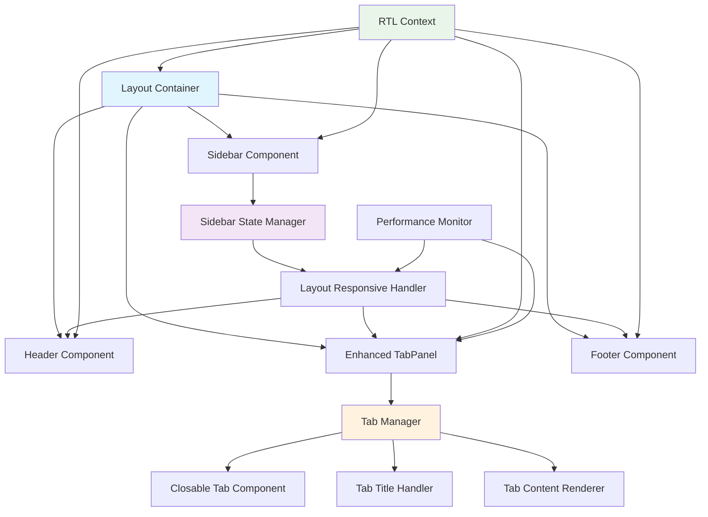

# Design Document

## Overview

This design addresses advanced layout and UI improvements for the Techno-ETL application, focusing on enhanced tab functionality with closable tabs, full title display, responsive sidebar behavior that affects all layout elements, comprehensive RTL support, and performance optimizations. The solution builds upon the existing Layout, TabPanel, and Sidebar components while introducing new features and improving the overall user experience.

## Architecture

### Enhanced Layout System Architecture

```
┌─────────────────────────────────────────────────────────────────┐
│                    Enhanced Layout System                        │
├─────────────────────────────────────────────────────────────────┤
│  Header Component (Responsive)                                  │
│  ├─ Logo/Brand (RTL-aware positioning)                         │
│  ├─ Navigation Controls (RTL-mirrored)                         │
│  ├─ User Menu (RTL-positioned)                                 │
│  └─ Sidebar Toggle (RTL-aware)                                 │
├─────────────────────────────────────────────────────────────────┤
│  Enhanced Sidebar (Collapsible + RTL)                          │
│  ├─ Logo Container (RTL-positioned)                            │
│  ├─ Navigation Tree (RTL-mirrored)                             │
│  ├─ Collapse/Expand Controls                                   │
│  └─ State Management (width, position, RTL)                    │
├─────────────────────────────────────────────────────────────────┤
│  Enhanced Tab System                                            │
│  ├─ Tab Container (Responsive width)                           │
│  ├─ Tab Items (Closable + Tooltips)                           │
│  ├─ Tab Content Area (Dynamic sizing)                          │
│  └─ Tab Management (Add, Close, Navigate)                      │
├─────────────────────────────────────────────────────────────────┤
│  Main Content Area (Responsive)                                │
│  ├─ Dynamic Width (Sidebar-aware)                              │
│  ├─ RTL Layout Support                                         │
│  └─ Performance Optimizations                                  │
├─────────────────────────────────────────────────────────────────┤
│  Footer Component (Responsive)                                 │
│  ├─ Dynamic Width (Sidebar-aware)                              │
│  ├─ RTL Layout Support                                         │
│  └─ Status Information                                         │
└─────────────────────────────────────────────────────────────────┘
```

### Component Interaction Flow



## Components and Interfaces

### 1. Enhanced Tab System

#### Enhanced TabPanel Component
```jsx
// Enhanced TabPanel with closable tabs and full title display
const EnhancedTabPanel = () => {
  const { tabs, activeTab, closeTab, openTab } = useTab();
  const { isRTL } = useLanguage();
  const theme = useTheme();
  
  return (
    <Box sx={{ display: 'flex', flexDirection: 'column', height: '100%' }}>
      <EnhancedTabBar 
        tabs={tabs}
        activeTab={activeTab}
        onTabChange={openTab}
        onTabClose={closeTab}
        isRTL={isRTL}
      />
      <TabContentArea activeTab={activeTab} />
    </Box>
  );
};
```

#### Closable Tab Component
```jsx
// Individual tab with close functionality and tooltip
const ClosableTab = ({ 
  tab, 
  isActive, 
  onSelect, 
  onClose, 
  isRTL,
  maxWidth = 200 
}) => {
  const [isHovered, setIsHovered] = useState(false);
  
  return (
    <Tooltip title={tab.fullTitle || tab.label} placement="bottom">
      <Box
        sx={{
          display: 'flex',
          alignItems: 'center',
          maxWidth,
          minWidth: 120,
          padding: '8px 12px',
          cursor: 'pointer',
          borderRadius: '8px 8px 0 0',
          backgroundColor: isActive ? 'background.paper' : 'transparent',
          border: isActive ? '1px solid' : 'none',
          borderColor: 'divider',
          borderBottom: 'none',
          transition: 'all 0.2s ease',
          '&:hover': {
            backgroundColor: 'action.hover'
          }
        }}
        onClick={onSelect}
        onMouseEnter={() => setIsHovered(true)}
        onMouseLeave={() => setIsHovered(false)}
      >
        <Typography
          variant="body2"
          sx={{
            flex: 1,
            overflow: 'hidden',
            textOverflow: 'ellipsis',
            whiteSpace: 'nowrap',
            marginRight: isRTL ? 0 : 1,
            marginLeft: isRTL ? 1 : 0
          }}
        >
          {tab.label}
        </Typography>
        
        {(isHovered || isActive) && (
          <IconButton
            size="small"
            onClick={(e) => {
              e.stopPropagation();
              onClose(tab.id);
            }}
            sx={{
              padding: '2px',
              marginLeft: isRTL ? 0 : 0.5,
              marginRight: isRTL ? 0.5 : 0,
              '&:hover': {
                backgroundColor: 'error.light',
                color: 'error.contrastText'
              }
            }}
          >
            <CloseIcon fontSize="small" />
          </IconButton>
        )}
      </Box>
    </Tooltip>
  );
};
```

### 2. Responsive Layout Manager

#### Layout Responsive Handler
```jsx
// Manages layout responsiveness based on sidebar state
const useLayoutResponsive = () => {
  const [sidebarOpen, setSidebarOpen] = useState(false);
  const { isRTL } = useLanguage();
  const theme = useTheme();
  const isMobile = useMediaQuery(theme.breakpoints.down('sm'));
  
  const layoutConfig = useMemo(() => ({
    sidebar: {
      width: sidebarOpen ? DRAWER_WIDTH : COLLAPSED_WIDTH,
      position: isRTL ? 'right' : 'left'
    },
    header: {
      marginLeft: isRTL ? 0 : (sidebarOpen ? DRAWER_WIDTH : COLLAPSED_WIDTH),
      marginRight: isRTL ? (sidebarOpen ? DRAWER_WIDTH : COLLAPSED_WIDTH) : 0,
      width: `calc(100% - ${sidebarOpen ? DRAWER_WIDTH : COLLAPSED_WIDTH}px)`
    },
    mainContent: {
      marginLeft: isRTL ? 0 : (sidebarOpen ? DRAWER_WIDTH : COLLAPSED_WIDTH),
      marginRight: isRTL ? (sidebarOpen ? DRAWER_WIDTH : COLLAPSED_WIDTH) : 0,
      width: `calc(100% - ${sidebarOpen ? DRAWER_WIDTH : COLLAPSED_WIDTH}px)`
    },
    footer: {
      marginLeft: isRTL ? 0 : (sidebarOpen ? DRAWER_WIDTH : COLLAPSED_WIDTH),
      marginRight: isRTL ? (sidebarOpen ? DRAWER_WIDTH : COLLAPSED_WIDTH) : 0,
      width: `calc(100% - ${sidebarOpen ? DRAWER_WIDTH : COLLAPSED_WIDTH}px)`
    }
  }), [sidebarOpen, isRTL, isMobile]);
  
  return {
    sidebarOpen,
    setSidebarOpen,
    layoutConfig,
    toggleSidebar: () => setSidebarOpen(prev => !prev)
  };
};
```

### 3. RTL Support System

#### RTL Layout Provider
```jsx
// Comprehensive RTL support for all layout components
const RTLLayoutProvider = ({ children }) => {
  const { currentLanguage, languages } = useLanguage();
  const isRTL = languages[currentLanguage]?.dir === 'rtl';
  
  const rtlConfig = useMemo(() => ({
    direction: isRTL ? 'rtl' : 'ltr',
    textAlign: isRTL ? 'right' : 'left',
    sidebar: {
      position: isRTL ? 'right' : 'left',
      borderSide: isRTL ? 'borderLeft' : 'borderRight'
    },
    tabs: {
      closeButtonSide: isRTL ? 'left' : 'right',
      textDirection: isRTL ? 'rtl' : 'ltr'
    },
    icons: {
      transform: isRTL ? 'scaleX(-1)' : 'none'
    }
  }), [isRTL]);
  
  return (
    <RTLContext.Provider value={{ isRTL, rtlConfig }}>
      <Box sx={{ direction: rtlConfig.direction }}>
        {children}
      </Box>
    </RTLContext.Provider>
  );
};
```

### 4. Performance Optimization System

#### Tab Performance Manager
```jsx
// Optimizes tab rendering and transitions
const useTabPerformance = () => {
  const [visibleTabs, setVisibleTabs] = useState([]);
  const [tabTransitions, setTabTransitions] = useState({});
  
  const optimizeTabRendering = useCallback((tabs, containerWidth) => {
    // Calculate visible tabs based on container width
    const tabWidth = 160; // Average tab width
    const maxVisibleTabs = Math.floor(containerWidth / tabWidth);
    
    return tabs.slice(0, maxVisibleTabs);
  }, []);
  
  const createTabTransition = useCallback((tabId, type) => {
    setTabTransitions(prev => ({
      ...prev,
      [tabId]: {
        type,
        timestamp: Date.now(),
        duration: 200
      }
    }));
    
    // Clean up transition after completion
    setTimeout(() => {
      setTabTransitions(prev => {
        const { [tabId]: removed, ...rest } = prev;
        return rest;
      });
    }, 200);
  }, []);
  
  return {
    visibleTabs,
    optimizeTabRendering,
    createTabTransition,
    tabTransitions
  };
};
```

## Data Models

### Enhanced Layout Configuration

```typescript
interface LayoutConfiguration {
  sidebar: {
    width: number;
    collapsedWidth: number;
    position: 'left' | 'right';
    isOpen: boolean;
    animationDuration: number;
  };
  header: {
    height: number;
    responsive: {
      marginLeft: number;
      marginRight: number;
      width: string;
    };
  };
  footer: {
    height: number;
    responsive: {
      marginLeft: number;
      marginRight: number;
      width: string;
    };
  };
  mainContent: {
    responsive: {
      marginLeft: number;
      marginRight: number;
      width: string;
      padding: number;
    };
  };
}

interface TabConfiguration {
  id: string;
  label: string;
  fullTitle?: string;
  component: React.ComponentType;
  closable: boolean;
  hasUnsavedChanges?: boolean;
  icon?: React.ReactNode;
  tooltip?: string;
}

interface RTLConfiguration {
  isRTL: boolean;
  direction: 'ltr' | 'rtl';
  textAlign: 'left' | 'right';
  sidebar: {
    position: 'left' | 'right';
    borderSide: 'borderLeft' | 'borderRight';
  };
  tabs: {
    closeButtonSide: 'left' | 'right';
    textDirection: 'ltr' | 'rtl';
  };
  icons: {
    transform: string;
  };
}

interface PerformanceMetrics {
  tabRenderTime: number;
  sidebarToggleTime: number;
  layoutTransitionTime: number;
  memoryUsage: number;
  activeTabsCount: number;
}
```

## Error Handling

### Tab Management Errors
1. **Tab Close Confirmation**: Prevent accidental closure of tabs with unsaved changes
2. **Maximum Tab Limit**: Handle scenarios where too many tabs are open
3. **Tab State Recovery**: Restore tabs after application restart or crash

### Layout Responsiveness Errors
1. **Sidebar Toggle Failures**: Handle cases where sidebar animation fails
2. **Layout Calculation Errors**: Fallback to default layout if calculations fail
3. **RTL Switching Issues**: Ensure smooth transitions between LTR and RTL modes

### Performance Degradation
1. **Memory Leaks**: Clean up tab components when closed
2. **Animation Performance**: Fallback to instant transitions on low-performance devices
3. **Render Optimization**: Virtualize tab content for large numbers of tabs

## Testing Strategy

### Tab Functionality Testing
1. **Unit Tests**: Test tab creation, closing, and navigation
2. **Integration Tests**: Test tab interaction with routing system
3. **Accessibility Tests**: Verify keyboard navigation and screen reader support

### Layout Responsiveness Testing
1. **Responsive Tests**: Test layout on different screen sizes
2. **Sidebar Tests**: Test collapse/expand functionality
3. **RTL Tests**: Verify proper RTL layout and behavior

### Performance Testing
1. **Load Tests**: Test with multiple tabs open
2. **Animation Tests**: Verify smooth transitions at 60fps
3. **Memory Tests**: Check for memory leaks with tab operations

## Implementation Phases

### Phase 1: Enhanced Tab System
- Implement closable tabs with confirmation dialogs
- Add full title display with tooltips
- Create tab overflow handling with scrolling
- Implement keyboard shortcuts for tab management

### Phase 2: Responsive Layout System
- Update Layout component to handle sidebar state changes
- Modify Header component to respond to sidebar width
- Update Footer component for responsive behavior
- Implement smooth transitions for all layout changes

### Phase 3: RTL Support Implementation
- Create RTL context and configuration system
- Update all layout components for RTL support
- Implement RTL-aware positioning and styling
- Add RTL-specific icon mirroring and text alignment

### Phase 4: Performance Optimizations
- Implement tab virtualization for large numbers of tabs
- Add performance monitoring and metrics
- Optimize animation performance with GPU acceleration
- Implement lazy loading for tab content

### Phase 5: Enhanced Styling and Polish
- Create consistent design system for all components
- Add hover effects and visual feedback
- Implement focus indicators for accessibility
- Add smooth micro-interactions and animations

## Performance Considerations

### Tab Management Performance
- **Virtual Scrolling**: Implement for large numbers of tabs
- **Lazy Loading**: Load tab content only when active
- **Memory Management**: Clean up inactive tab components
- **Debounced Updates**: Prevent excessive re-renders during rapid tab switching

### Layout Animation Performance
- **GPU Acceleration**: Use transform3d for smooth animations
- **Reduced Motion**: Respect user's motion preferences
- **Frame Rate Monitoring**: Ensure 60fps for all transitions
- **Batch Updates**: Group layout changes to minimize reflows

### RTL Performance
- **CSS-in-JS Optimization**: Cache RTL styles to prevent recalculation
- **Direction Switching**: Optimize RTL/LTR transitions
- **Icon Caching**: Pre-load mirrored icons for RTL mode

## Security Considerations

### Tab Security
- **Content Isolation**: Ensure tab content doesn't leak between tabs
- **XSS Prevention**: Sanitize tab titles and content
- **Memory Protection**: Prevent memory-based attacks through tab manipulation

### Layout Security
- **CSS Injection**: Prevent malicious CSS through dynamic styling
- **Event Handling**: Secure event listeners for layout interactions
- **State Management**: Protect layout state from unauthorized modifications

## Accessibility Considerations

### Tab Accessibility
- **Keyboard Navigation**: Full keyboard support for tab management
- **Screen Reader Support**: Proper ARIA labels and descriptions
- **Focus Management**: Clear focus indicators and logical tab order
- **High Contrast**: Support for high contrast themes

### Layout Accessibility
- **Responsive Design**: Ensure usability across all screen sizes
- **Motion Sensitivity**: Respect reduced motion preferences
- **Color Contrast**: Maintain proper contrast ratios in all themes
- **Touch Targets**: Ensure adequate touch target sizes on mobile devices