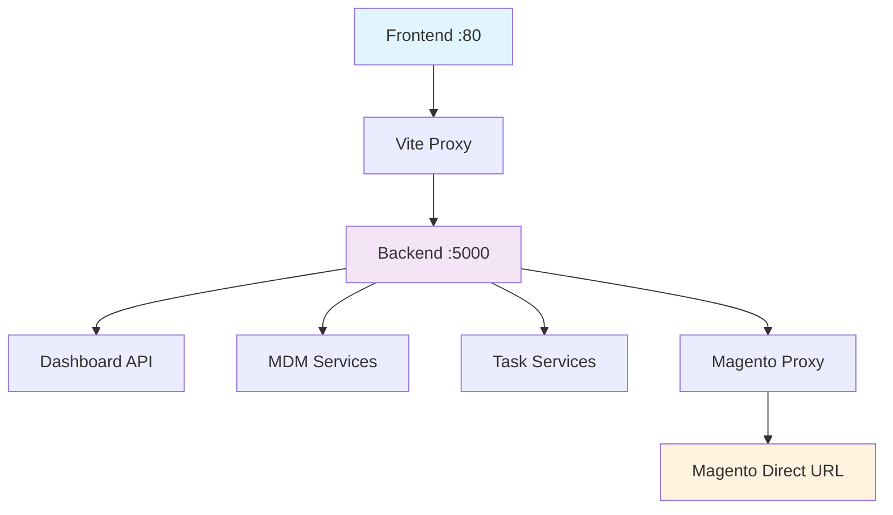

# Design Document

## Overview

This design addresses the optimization of port configuration, service routing, and UI component error fixes for the Techno-ETL application. The solution focuses on standardizing development environment ports, implementing centralized API routing, and resolving Material-UI Tooltip component errors that occur when disabled buttons are wrapped in tooltips.

## Architecture

### Port Configuration Architecture

```
┌─────────────────────────────────────────────────────────────┐
│                    Development Environment                   │
├─────────────────────────────────────────────────────────────┤
│  Frontend (Vite Dev Server)                                │
│  Port: 80                                                   │
│  Host: 0.0.0.0                                            │
├─────────────────────────────────────────────────────────────┤
│  Backend (Express Server)                                   │
│  Port: 5000                                                │
│  Host: localhost                                           │
├─────────────────────────────────────────────────────────────┤
│  Service Routing Layer                                      │
│  ├─ Dashboard API: localhost:5000/api                      │
│  ├─ MDM Services: localhost:5000/api/mdm                   │
│  ├─ Task Services: localhost:5000/api/task                 │
│  └─ Magento Services: Direct URL (configurable)           │
└─────────────────────────────────────────────────────────────┘
```

### Service Communication Flow



## Components and Interfaces

### 1. Configuration Management

#### Frontend Configuration (vite.config.js)
- **Port Setting**: Standardize to port 80 for development
- **Proxy Configuration**: Route all `/api/*` requests to `localhost:5000`
- **Host Configuration**: Maintain `0.0.0.0` for network accessibility

#### Backend Configuration (backend/package.json)
- **Port Setting**: Standardize to port 5000
- **CORS Configuration**: Allow frontend origin on port 80
- **Environment Variables**: Support for configurable ports

#### Service API Configuration (dashboardApi.js)
- **Base URL**: Use `localhost:5000/api` for all non-Magento services
- **Magento Routing**: Conditional routing based on service type
- **Error Handling**: Graceful fallback for service unavailability

### 2. UI Component Error Resolution

#### Tooltip Wrapper Component
```jsx
// TooltipWrapper.jsx - Handles disabled button tooltips
const TooltipWrapper = ({ children, disabled, title, ...props }) => {
  if (disabled) {
    return (
      <Tooltip title={title} {...props}>
        <span style={{ display: 'inline-block' }}>
          {children}
        </span>
      </Tooltip>
    );
  }
  
  return (
    <Tooltip title={title} {...props}>
      {children}
    </Tooltip>
  );
};
```

#### Component Updates Required
1. **UnifiedGridToolbar.jsx**: Wrap disabled buttons in span elements
2. **ProductManagementGrid.jsx**: Fix Tooltip usage around disabled elements
3. **GridToolbarActions.jsx**: Implement TooltipWrapper for action buttons

### 3. Service Routing Layer

#### API Service Factory
```javascript
// apiServiceFactory.js
class ApiServiceFactory {
  static createService(serviceType, config = {}) {
    const baseURL = serviceType === 'magento' && config.directUrl 
      ? config.directUrl 
      : 'http://localhost:5000/api';
      
    return axios.create({
      baseURL,
      timeout: config.timeout || 10000,
      headers: config.headers || { 'Content-Type': 'application/json' }
    });
  }
}
```

## Data Models

### Configuration Schema

```typescript
interface PortConfiguration {
  frontend: {
    port: number;           // 80
    host: string;          // "0.0.0.0"
    proxy: ProxyConfig;
  };
  backend: {
    port: number;          // 5000
    host: string;          // "localhost"
    cors: CorsConfig;
  };
}

interface ServiceRouting {
  dashboard: string;       // "localhost:5000/api"
  mdm: string;            // "localhost:5000/api/mdm"
  task: string;           // "localhost:5000/api/task"
  magento: {
    useProxy: boolean;     // false for direct URLs
    directUrl?: string;    // configurable Magento URL
    proxyPath: string;     // "localhost:5000/api/magento"
  };
}

interface TooltipWrapperProps {
  children: React.ReactNode;
  disabled?: boolean;
  title: string;
  placement?: TooltipPlacement;
}
```

## Error Handling

### Port Conflict Resolution
1. **Port Availability Check**: Verify ports 80 and 5000 are available
2. **Fallback Ports**: Use 3000 (frontend) and 5001 (backend) if conflicts exist
3. **Environment Detection**: Different ports for development vs production

### Service Communication Errors
1. **Connection Timeout**: 10-second timeout with retry logic
2. **Service Unavailable**: Graceful degradation with cached data
3. **Proxy Errors**: Detailed logging and error reporting

### UI Component Error Prevention
1. **Tooltip Validation**: Check for disabled state before wrapping
2. **Event Handling**: Ensure proper event propagation for wrapped elements
3. **Accessibility**: Maintain ARIA attributes through wrapper components

## Testing Strategy

### Port Configuration Testing
1. **Unit Tests**: Verify configuration loading and validation
2. **Integration Tests**: Test frontend-backend communication
3. **E2E Tests**: Validate complete service routing flow

### UI Component Testing
1. **Component Tests**: Test TooltipWrapper with disabled/enabled states
2. **Visual Regression**: Ensure no visual changes after fixes
3. **Accessibility Tests**: Verify ARIA compliance and keyboard navigation

### Service Routing Testing
1. **API Tests**: Verify all service endpoints respond correctly
2. **Proxy Tests**: Test Vite proxy configuration
3. **Magento Integration**: Test both proxy and direct URL routing

## Implementation Phases

### Phase 1: Port Standardization
- Update vite.config.js port settings
- Update backend package.json scripts
- Update environment variables and documentation

### Phase 2: Service Routing Optimization
- Implement centralized API service factory
- Update dashboardApi.js routing logic
- Configure Magento service routing

### Phase 3: UI Error Resolution
- Create TooltipWrapper component
- Update UnifiedGridToolbar component
- Update ProductManagementGrid component
- Test all Tooltip implementations

### Phase 4: Testing and Validation
- Implement comprehensive test suite
- Validate development environment setup
- Document configuration and troubleshooting

## Performance Considerations

### Development Server Optimization
- **HMR Performance**: Maintain fast hot module replacement
- **Proxy Efficiency**: Minimize proxy overhead
- **Bundle Size**: No impact on production bundle size

### Service Communication
- **Connection Pooling**: Reuse HTTP connections
- **Request Caching**: Cache non-critical API responses
- **Error Recovery**: Fast failover for service issues

## Security Considerations

### Port Security
- **Firewall Rules**: Document required port access
- **CORS Configuration**: Restrict origins in production
- **Environment Isolation**: Separate dev/prod configurations

### Service Communication
- **API Authentication**: Maintain existing auth mechanisms
- **Request Validation**: Validate all proxied requests
- **Error Information**: Limit error details in responses