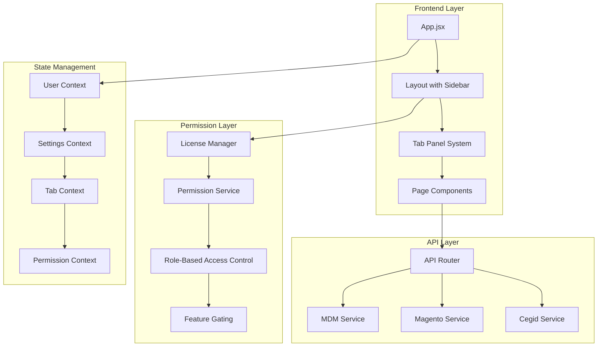

# Design Document

## Overview

This design document outlines a comprehensive refactoring of the TECHNO-ETL project architecture to address critical flaws including code duplication, inconsistent navigation patterns, fragmented permission systems, and conflicting API usage patterns. The refactoring will establish a clean, scalable architecture with proper separation of concerns, unified navigation through tab panels, and robust permission management.

## Architecture

### Current Architecture Analysis

The current system has several architectural issues:
- **Mixed Navigation Patterns**: Both direct routing (`SimplifiedRouter.jsx`) and tab-based navigation (`TabContext.jsx`) coexist, causing confusion
- **Inconsistent API Usage**: Some components use MDM endpoints while others use Magento REST API without clear separation
- **Fragmented Permissions**: Basic permission system exists but lacks integration with licensing and role-based access
- **Code Duplication**: Multiple grid components with similar functionality
- **Configuration Scattered**: User settings spread across multiple contexts and utilities

### Target Architecture

The refactored architecture will implement:



## Components and Interfaces

### 1. Permission System Architecture

#### LicenseManager
```typescript
interface LicenseManager {
  checkUserLicense(userId: string): Promise<LicenseStatus>
  validateFeatureAccess(feature: string, userId: string): boolean
  getLicenseLevel(userId: string): LicenseLevel
  updateLicenseStatus(userId: string, license: License): Promise<void>
}

interface LicenseStatus {
  isValid: boolean
  level: 'basic' | 'professional' | 'enterprise' | 'admin'
  expiryDate: Date
  features: string[]
  permissions: Permission[]
}
```

#### PermissionService
```typescript
interface PermissionService {
  hasPermission(action: string, resource: string): boolean
  getPermissions(userId: string): Permission[]
  checkFeatureAccess(feature: string): boolean
  filterMenuItems(menuItems: MenuItem[]): MenuItem[]
}

interface Permission {
  resource: string
  actions: ('view' | 'edit' | 'delete' | 'add')[]
  conditions?: Record<string, any>
}
```

### 2. Unified Navigation System

#### Enhanced TabContext
```typescript
interface TabContextValue {
  tabs: Tab[]
  activeTab: string
  openTab(tabId: string, options?: TabOptions): void
  closeTab(tabId: string): void
  getActiveComponent(): React.ComponentType
  canOpenTab(tabId: string): boolean // Permission check
}

interface Tab {
  id: string
  label: string
  component: string
  closeable: boolean
  permissions?: string[]
  licenseRequired?: boolean
}
```

#### Sidebar with Permission Integration
```typescript
interface SidebarProps {
  menuTree: MenuTreeNode[]
  userPermissions: Permission[]
  licenseLevel: LicenseLevel
  onMenuItemClick: (item: MenuItem) => void
}

interface MenuTreeNode {
  id: string
  label: string
  icon: React.ComponentType
  children?: MenuTreeNode[]
  permissions?: string[]
  licenseRequired?: boolean
  roleRequired?: string
}
```

### 3. API Integration Strategy

#### Unified API Router
```typescript
interface APIRouter {
  route(endpoint: string, context: APIContext): Promise<any>
  setStrategy(service: string, strategy: 'direct' | 'backend'): void
  getStrategy(service: string): 'direct' | 'backend'
}

interface APIContext {
  service: 'mdm' | 'magento' | 'cegid'
  operation: 'read' | 'write' | 'delete'
  resource: string
  userSettings: UserSettings
}
```

#### Service Implementations
```typescript
interface MDMService {
  getProducts(filters?: any): Promise<Product[]>
  getStock(filters?: any): Promise<Stock[]>
  getSources(): Promise<Source[]>
}

interface MagentoService {
  getProducts(filters?: any): Promise<Product[]>
  getOrders(filters?: any): Promise<Order[]>
  getCustomers(filters?: any): Promise<Customer[]>
  getCMSPages(): Promise<CMSPage[]>
  getCategories(): Promise<Category[]>
}
```

### 4. Enhanced User Profile System

#### Configuration Sections
```typescript
interface UserProfileConfig {
  personalInfo: PersonalInfo
  apiSettings: APISettings
  appearanceSettings: AppearanceSettings
  permissionSettings: PermissionSettings
}

interface APISettings {
  mdm: MDMConfig
  magento: MagentoConfig
  cegid: CegidConfig
  useDirectConnection: boolean
}

interface MagentoConfig {
  baseUrl: string
  apiKey: string
  storeId: string
  enableDirectAccess: boolean
}
```

## Data Models

### User and License Models

```typescript
interface User {
  id: string
  email: string
  name: string
  role: UserRole
  license: License
  settings: UserSettings
  permissions: Permission[]
}

interface License {
  id: string
  userId: string
  level: LicenseLevel
  features: string[]
  isValid: boolean
  expiryDate: Date
  maxUsers?: number
}

enum LicenseLevel {
  BASIC = 'basic',
  PROFESSIONAL = 'professional', 
  ENTERPRISE = 'enterprise',
  ADMIN = 'admin'
}

enum UserRole {
  USER = 'user',
  MANAGER = 'manager',
  ADMIN = 'admin',
  SUPER_ADMIN = 'super_admin'
}
```

### Product Management Models

```typescript
interface Product {
  id: string
  sku: string
  name: string
  categories: Category[]
  attributes: ProductAttribute[]
  stock?: Stock
  source: 'mdm' | 'magento' | 'cegid'
}

interface Category {
  id: string
  name: string
  parentId?: string
  children?: Category[]
  productCount: number
  level: number
}

interface CategoryManagementOperation {
  type: 'move' | 'add' | 'remove' | 'create' | 'delete'
  productIds?: string[]
  categoryId: string
  targetCategoryId?: string
}
```

## Error Handling

### Centralized Error Management

```typescript
interface ErrorHandler {
  handleAPIError(error: APIError): void
  handlePermissionError(error: PermissionError): void
  handleLicenseError(error: LicenseError): void
  showUserFriendlyMessage(error: Error): void
}

interface APIError extends Error {
  service: string
  endpoint: string
  statusCode: number
  retryable: boolean
}

interface PermissionError extends Error {
  requiredPermission: string
  userPermissions: string[]
  resource: string
}
```

### Error Boundaries

```typescript
interface ErrorBoundaryProps {
  fallback: React.ComponentType<{error: Error}>
  onError?: (error: Error, errorInfo: ErrorInfo) => void
  resetOnPropsChange?: boolean
}
```

## Testing Strategy

### Unit Testing Approach

1. **Permission System Tests**
   - License validation logic
   - Permission checking algorithms
   - Role-based access control

2. **API Integration Tests**
   - Service routing logic
   - Direct vs backend API calls
   - Error handling and fallbacks

3. **Component Tests**
   - Tab navigation behavior
   - Menu filtering based on permissions
   - User profile configuration

### Integration Testing

1. **End-to-End Navigation Tests**
   - Tab opening/closing with permissions
   - Menu item access control
   - Route protection

2. **API Integration Tests**
   - MDM vs Magento API routing
   - Direct connection fallbacks
   - Configuration-based routing

### Performance Testing

1. **License Check Performance**
   - Caching strategies for license validation
   - Permission lookup optimization

2. **Navigation Performance**
   - Tab switching speed
   - Menu rendering with large permission sets

## Implementation Phases

### Phase 1: Permission System Foundation
- Implement LicenseManager and PermissionService
- Create unified permission checking system
- Update existing components to use permission system

### Phase 2: Navigation System Refactoring
- Enhance TabContext with permission integration
- Update Sidebar to filter based on permissions
- Ensure all pages open in tab panels consistently

### Phase 3: API Integration Standardization
- Implement APIRouter with service-specific strategies
- Update all components to use unified API approach
- Add configuration-based routing

### Phase 4: User Profile Enhancement
- Add MDM, Magento, and Cegid configuration sections
- Implement direct connection capabilities
- Add settings validation and testing

### Phase 5: Product Management Tools
- Create comprehensive category management interface
- Implement product movement and organization tools
- Add bulk operations with proper permission checks

### Phase 6: Architecture Cleanup
- Remove duplicate code and consolidate components
- Standardize patterns across the application
- Optimize performance and bundle size

## Security Considerations

### Authentication and Authorization
- JWT token validation for API calls
- Role-based access control at component level
- License validation on critical operations

### API Security
- Secure storage of API credentials
- Encrypted communication for direct connections
- Rate limiting and request validation

### Data Protection
- Sensitive configuration encryption
- Audit logging for permission changes
- Secure session management

## Deployment Strategy

### Backward Compatibility
- Gradual migration approach
- Feature flags for new functionality
- Fallback mechanisms for existing users

### Configuration Management
- Environment-specific settings
- Runtime configuration updates
- Migration scripts for existing data

### Monitoring and Observability
- Permission usage analytics
- API routing performance metrics
- Error tracking and alerting