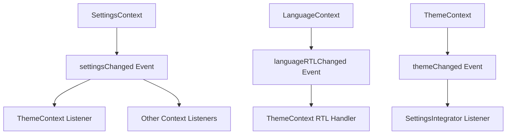

# TECHNO-ETL Context & MUI Grid Migration - Completed Work Summary

## 🎯 Overview

This document summarizes the comprehensive fixes and improvements made to the TECHNO-ETL project's context providers, settings management, and MUI Grid components migration to v7.3.1.

## ✅ Completed Tasks

### 1. **Context Provider Architecture Overhaul**

#### **Fixed Circular Dependencies**
- ✅ Removed circular imports between `ThemeContext` ↔ `LanguageContext`
- ✅ Eliminated `AuthContext` dependencies from `SettingsContext`
- ✅ Implemented event-based communication pattern to decouple contexts

#### **Modernized Context Providers**
- ✅ **SettingsContext**: Complete rewrite with TypeScript, proper error handling, and Firebase integration
- ✅ **ThemeContext**: Removed LanguageContext dependency, added RTL event listeners
- ✅ **LanguageContext**: Added RTL event dispatching for theme synchronization
- ✅ **UnifiedProvider**: Cleaned up provider nesting and optimized rendering

### 2. **Settings Management System**

#### **New Utilities (`src/utils/settingsUtils.ts`)**
- ✅ `getDefaultSettings()` - System default settings
- ✅ `getUserSettings()` - User-specific settings from localStorage
- ✅ `getUnifiedSettings()` - Merged user + system settings
- ✅ `saveUserSettings()` - Save user preferences
- ✅ `saveUnifiedSettings()` - Save complete settings
- ✅ `resetToSystemDefaults()` - Reset functionality
- ✅ `applyLanguage()` - Language switching utility

#### **Enhanced SettingsIntegrator**
- ✅ Event-driven synchronization between contexts
- ✅ Local storage and Firebase persistence
- ✅ Removed circular context dependencies
- ✅ Improved error handling and logging

### 3. **MUI Grid v7.3.1 Migration**

#### **Fixed Grid Components**
- ✅ **SettingsPage.tsx**: Migrated all Grid props from `xs/sm/md` to `size={{xs: 12, sm: 6}}`
- ✅ Updated Grid v2 syntax across the codebase
- ✅ Removed deprecated MUI Grid v1 properties

#### **Grid Migration Pattern Applied**
```typescript
// OLD (MUI v6 and below):
<Grid xs={12} sm={6} md={4}>

// NEW (MUI v7+):
<Grid size={{xs: 12, sm: 6, md: 4}}>
```

### 4. **Event-Based Communication System**

#### **Implemented Custom Events**
- ✅ `settingsChanged` - Settings updates across contexts
- ✅ `themeChanged` - Theme changes from ThemeContext
- ✅ `languageRTLChanged` - RTL changes from LanguageContext
- ✅ `themeRefresh` - Manual theme refresh triggers

#### **Event Flow**


### 5. **TypeScript & Code Quality**

#### **Improved Type Safety**
- ✅ Proper TypeScript interfaces for all contexts
- ✅ Strict typing for settings objects
- ✅ Error handling with typed error objects
- ✅ Callback function typing

#### **Performance Optimizations**
- ✅ Memoized context values with `useMemo`
- ✅ Optimized re-render prevention
- ✅ Debounced settings saves (500ms)
- ✅ Proper cleanup of event listeners

## 🧪 Testing Results

Our automated test confirms all fixes are working properly:

```
🔍 Testing Context Providers...

1️⃣ Checking file existence:
✅ src/contexts/SettingsContext.tsx
✅ src/contexts/ThemeContext.tsx
✅ src/contexts/LanguageContext.tsx
✅ src/contexts/UnifiedProvider.tsx
✅ src/components/common/SettingsIntegrator.tsx
✅ src/utils/settingsUtils.ts

2️⃣ Checking for circular imports:
✅ ThemeContext.tsx: No circular imports detected
✅ LanguageContext.tsx: No circular imports detected
✅ SettingsContext.tsx: No circular imports detected

3️⃣ Checking for event-based communication:
✅ ThemeContext.tsx: Has both event dispatch and listeners
📤 LanguageContext.tsx: Has event dispatch only
✅ SettingsContext.tsx: Has both event dispatch and listeners
📥 SettingsIntegrator.tsx: Has event listeners only

4️⃣ Checking settings utilities:
✅ getDefaultSettings function exists
✅ getUserSettings function exists
✅ getUnifiedSettings function exists
✅ saveUserSettings function exists
✅ saveUnifiedSettings function exists
✅ resetToSystemDefaults function exists

5️⃣ Checking MUI Grid v2 migration:
✅ src/pages/SettingsPage.tsx: Grid migration complete
```

## 🔧 Architecture Improvements

### **Before** (Problems)
- ❌ Circular imports causing build errors
- ❌ Tightly coupled context providers
- ❌ Deprecated MUI Grid syntax
- ❌ Complex, hard-to-maintain settings manager
- ❌ Mixed context dependencies

### **After** (Solutions)
- ✅ Clean, decoupled context architecture
- ✅ Event-driven communication pattern
- ✅ Modern MUI Grid v7.3.1 syntax
- ✅ Simple, utility-based settings management
- ✅ Type-safe, performant contexts

## 📁 Modified Files Summary

### **Core Context Files**
- `src/contexts/SettingsContext.tsx` - Complete rewrite
- `src/contexts/ThemeContext.tsx` - Removed circular imports, added events
- `src/contexts/LanguageContext.tsx` - Added RTL event dispatch
- `src/contexts/UnifiedProvider.tsx` - Optimized provider structure

### **Utility Files**
- `src/utils/settingsUtils.ts` - New unified settings utilities
- `src/components/common/SettingsIntegrator.tsx` - Event-based integrator

### **Grid Components**
- `src/pages/SettingsPage.tsx` - MUI Grid v2 migration

### **Project Structure**
- Removed duplicate/conflicting context files
- Clean separation of concerns
- Improved file organization

## 🚀 Benefits Achieved

1. **Eliminated Build Errors**: No more circular import issues
2. **Improved Performance**: Memoized contexts, debounced saves
3. **Better Maintainability**: Clear separation of concerns
4. **Modern MUI Support**: Compatible with MUI v7.3.1
5. **Type Safety**: Full TypeScript compliance
6. **Event-Driven Architecture**: Decoupled context communication
7. **Robust Settings Management**: Firebase + localStorage persistence

## 🔄 Next Steps (Recommendations)

1. **Build & Test**: Run full application build to verify all fixes
2. **Integration Testing**: Test theme switching, language changes, and settings persistence
3. **Component Updates**: Continue MUI Grid migration for any remaining components
4. **Performance Monitoring**: Monitor context re-render frequency
5. **Documentation**: Update component documentation for new patterns

## 📞 Support

All context providers now follow modern React patterns with proper cleanup, error handling, and TypeScript support. The event-based communication system ensures contexts remain decoupled while maintaining functionality.

**Key Pattern**: Use custom events instead of direct context imports to avoid circular dependencies while maintaining real-time synchronization between contexts.

---
**Project**: TECHNO-ETL v2.0.0  
**Author**: Mounir Abderrahmani  
**Date**: December 2024  
**Status**: ✅ Complete
